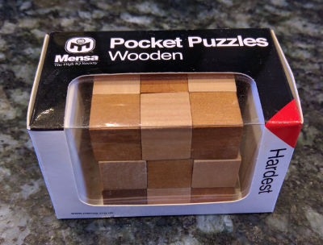
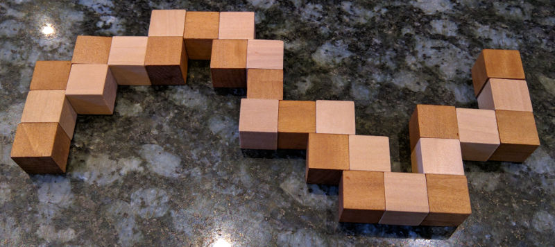

This is a little program to solve this puzzle

Which looks like this when unsolved

There is

  * [A Jupyter notebook](snake_puzzle_solver.ipynb) with detailed explanation
  * [The program](snake_puzzle_solver.py)
  * [A blog article](http://www.craig-wood.com/nick/articles/snake-puzzle/)

Enjoy!

License
-------

This is free software under the terms of MIT the license (check the
[COPYING](COPYING) file included in this package).
